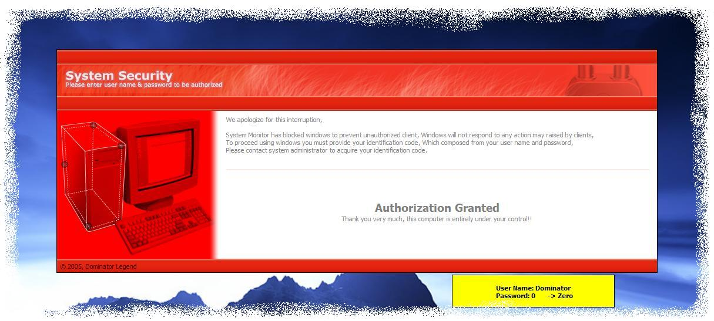

<div align="center">

## Powerfull System Locker V\.3 2006


</div>

### Description

[New Modifications]-[V.3 - 2006]

This new realease solve some bugs, and also improve some functions, like Process hiding, programs minimization, GUI, and also include the anti Win-L compination, thanks to "DMS-Meshal" for sharing that module, Also please if you found it helpfull, Rate it!!!!!!!!

----

Important Nots!!!

Locker i.e. this application cause problem with firewalls, cause firewall may restrict some function implemented by locker, such as keyboard hooking!!!!, so avoide firewallssssssss

----

Just get relax and enjoy with this quality release,,,,

This locker able to lock your computer and cancel all hotkeys including Ctrl+Alt+Del, This locker is programmable i.e. you can lock your pc from another computer through network unlike windows login screen it may work as locker but you can't program it, also this locker can be used in cyber cafe to control users actions, it can be used in many application.

----

Programming Details:

----

First of all we have to cancel all hotkey, so I register the ALT + TAB as hotkey which cancel this combination, Then prevent the shell from auto startup when its closed, Then Destroy the shell which result in canceling the start menu hotkey and CTR + ESC combination, And Finally cancel the task manager by telling the user that admin has cancel it, and for more protection I open the task manager exe for binary so I cancel the message which raised when user press the combination, so client feel that CTR + ALT + DEL Is Useless,

The Code Is Exciting, Its only tested on XP platform, But I think that its important to XP than any other platform, cause its harder to do it in NT than 9X, also canceling hotkeys on xp is harder than 9x.

Any suggestion or idea are welcome, Any bugs detection will be appreciated.

Please Vote If Like It, thanks
 
### More Info
 
Verfication code (Username And Password)

Password is 0 [Zero]

Disaple firewalls

Unblock System

Close Any Explorer Windows

Problems with firewalls


<span>             |<span>
---                |---
**Submitted On**   |2005-03-15 23:57:14
**By**             |[Dominator Legend](https://github.com/Planet-Source-Code/PSCIndex/blob/master/ByAuthor/dominator-legend.md)
**Level**          |Advanced
**User Rating**    |4.5 (103 globes from 23 users)
**Compatibility**  |VB 6\.0
**Category**       |[Windows System Services](https://github.com/Planet-Source-Code/PSCIndex/blob/master/ByCategory/windows-system-services__1-35.md)
**World**          |[Visual Basic](https://github.com/Planet-Source-Code/PSCIndex/blob/master/ByWorld/visual-basic.md)
**Archive File**   |[Powerfull\_1981893212006\.zip](https://github.com/Planet-Source-Code/dominator-legend-powerfull-system-locker-v-3-2006__1-61991/archive/master.zip)

### API Declarations

```
comctl32.dll
user32
PSAPI.DLL
kernel32.dll
advapi32.dll
```


